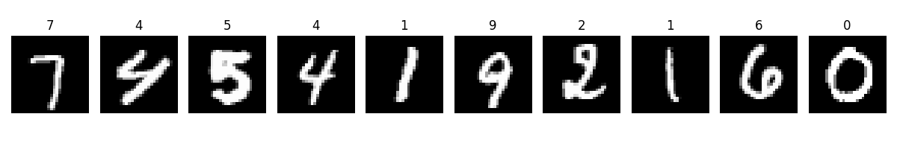
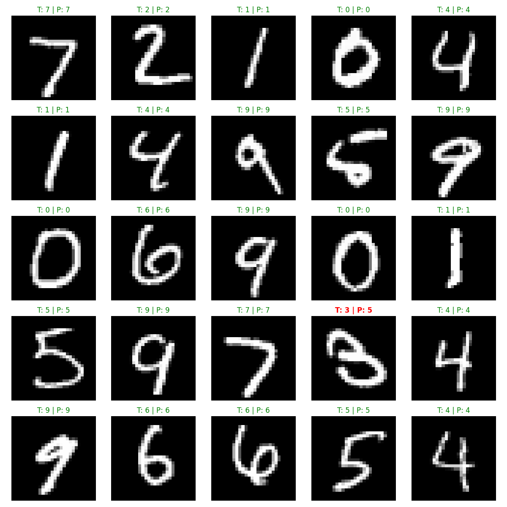
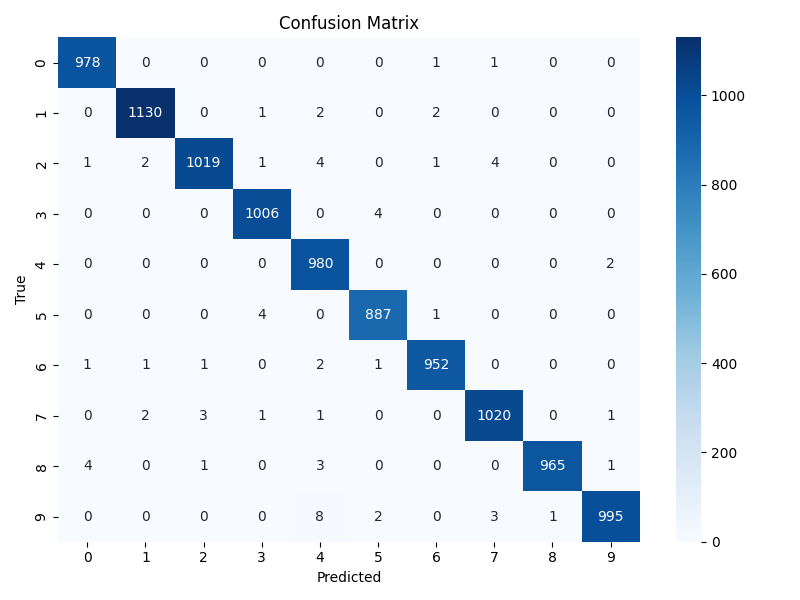
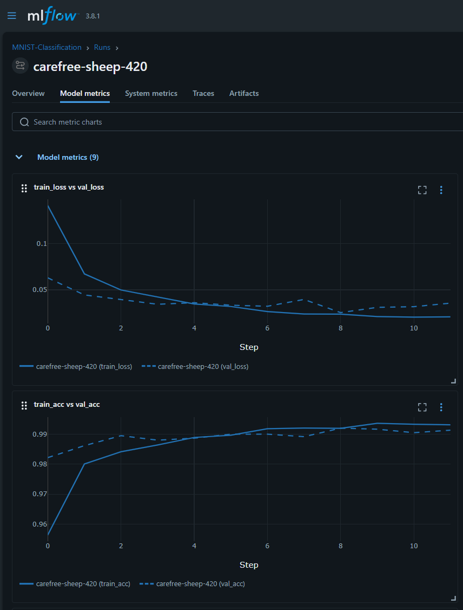

# Modern MNIST: End-to-End CNN with MLOps

[](https://www.python.org/)
[](https://pytorch.org/)
[](https://mlflow.org/)
[](LICENSE)

---

## Project Overview

While MNIST is a classic dataset, this project is not just about achieving high accuracy—it's about mastering the modern Deep Learning lifecycle. Here, MNIST serves as a "Baseline Playground" to demonstrate best practices in model design, hyperparameter optimization, and experiment tracking. The result is a robust, production-grade pipeline that can be adapted for real-world tasks.

- MNIST data 
  

---

## Key Features

- **Robust CNN Architecture:** Conv2D layers, BatchNormalization, and Dropout for regularization.
- **Automated Hyperparameter Tuning:** Optuna optimizes learning rate, batch size, and dropout.
- **Experiment Tracking:** MLflow logs hyperparameters, metrics, and artifacts for every run.
- **Production-Ready Code:** Modular structure, type hints, and Google-style docstrings throughout.

---

## Model Performance

| Metric    | Value (Example) |
|-----------|-----------------|
| Accuracy  | 99.32%          |
| F1-Score  | 99.31%          |

**Visuals:**

- Sample Predictions  
  

- Confusion Matrix  
  

- MLflow  
  

---

## Quick Start Guide

### Installation

```bash
pip install -r requirements.txt
```

### Training Pipeline

```bash
python src/main.py
```

### Inference on a Single Image

```python
from model import MNISTCNN
from inference import predict_image
import torch
import numpy as np

model = MNISTCNN()
model.load_state_dict(torch.load("best_model.pth", map_location="cpu"))
model.eval()

# image_array: np.ndarray of shape (28, 28)
pred, conf = predict_image(model, image_array)
print(f"Predicted digit: {pred}, Confidence: {conf:.2f}")
```

---

## Project Structure

```
mnist/
├── data/                # MNIST data directory
├── src/
│   ├── data.py          # Data loading & EDA
│   ├── model.py         # CNN model definition
│   ├── train.py         # Training, Optuna, MLflow
│   ├── inference.py     # Inference pipeline
│   ├── utils.py         # Utilities (plots, early stopping)
│   └── main.py          # Project entry point
├── requirements.txt
├── check_cuda.py
└── assets/              # Visuals for README 
```

---

## License

This project is licensed under the MIT License.